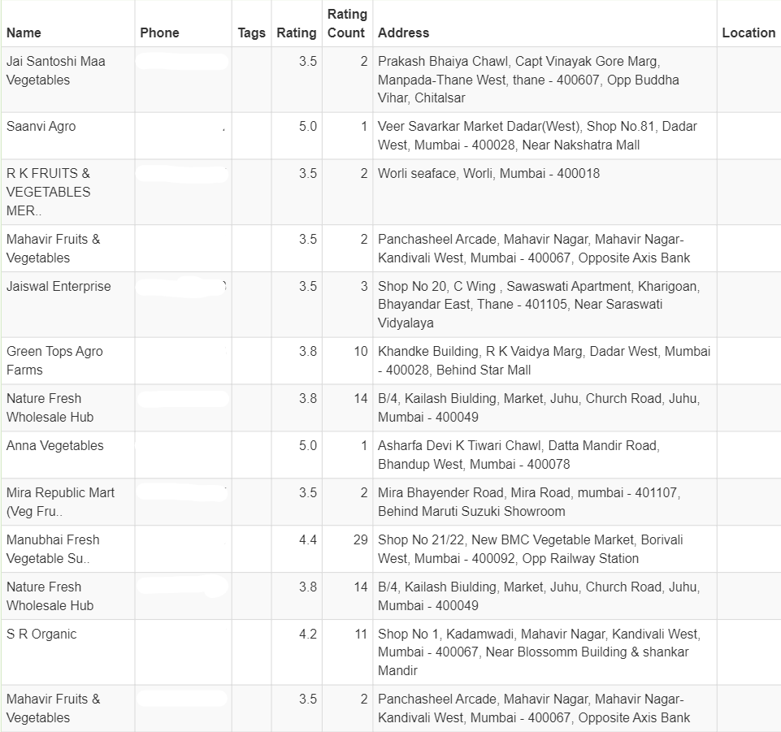

Justdial scraper
===================================

Scrapes the <b>list of service provider details (like Company name, Address, City, Phone no, Rating etc)</b> from the given link and generates .csv file for it.

## Packages/Tools used -
* [Beautiful Soup](https://pypi.org/project/beautifulsoup4/)
* [Requests](https://pypi.org/project/requests/) 

## How to use -
1. Install the required packages using [pip](https://pypi.org/project/pip/).
2. Run the python file.
3. Enter the website url which you want to scrape on console when asked (Eg. https://www.justdial.com/Mumbai/Vegetable-Vendors-in-Andheri-West/nct-10516812/) 
4. Enter the no of pages to scrape on console when asked.

### Screenshot -
  
  